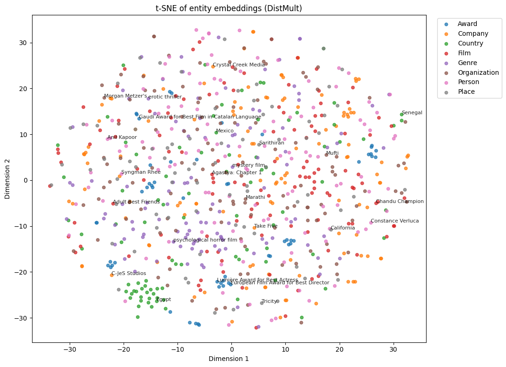

# Web Semantics Project: Movie Knowledge Graph

An end-to-end semantic web pipeline in the movie domain, covering data acquisition, information extraction, RDF graph construction, Wikidata linking, SWRL reasoning, knowledge graph embedding, and graph-grounded question answering over RDF/SPARQL.

## Project Highlights

- Built an initial RDF movie graph with **1030 film nodes**
- Expanded the linked graph to **42958 triples**
- Inferred **28 AwardWinningFilm** instances through SWRL reasoning
- Prepared a KGE subset with **3213 triples**, **1826 entities**, and **61 relations**
- Compared **TransE** and **DistMult**, with **TransE** achieving the best MRR
- Evaluated a graph-grounded QA pipeline that answered **6/6 evaluation questions successfully**

## Project Snapshot



## Repository Overview

This repository contains six notebooks that form a complete pipeline:

### 1. Data Crawling
**Notebook:** `notebooks/01_data_crawling.ipynb`

Collects movie data from Wikidata and retrieves Wikipedia summaries to form the initial corpus.

**Artifacts**
- `artifacts/notebook_1/wikidata_films.json`
- `artifacts/notebook_1/wiki_plots.jsonl`
- `artifacts/notebook_1/wiki_missing_summaries.csv`
- `artifacts/notebook_1/cleaned_plots.jsonl`

### 2. Cleaning, NER, and Relation Extraction
**Notebook:** `notebooks/02_cleaning_ner_relation_extraction.ipynb`

Cleans the collected summaries, extracts named entities, and produces candidate relations for downstream graph construction.

**Results**
- Cleaned summaries: **580**
- Entity mentions: **5262**
- Candidate relations: **655**

**Artifacts**
- `artifacts/notebook_2/extracted_entities.csv`
- `artifacts/notebook_2/extracted_relations.csv`
- `artifacts/notebook_2/extracted_knowledge.csv`

### 3. RDF Graph and Ontology Construction
**Notebook:** `notebooks/03_rdf_graph_ontology.ipynb`

Builds the initial private RDF graph by combining structured movie metadata with extracted entities and extracted relations.

**Graph statistics**
- Film nodes: **1030**
- `directedBy`: **666**
- `hasCastMember`: **3008**
- `hasGenre`: **856**
- `hasCountry`: **985**
- `wonAward`: **68**
- `producedBy`: **271**
- `followedBy`: **10**
- `precededBy`: **22**
- `mentionsEntity`: **5095**
- Extracted relation edges: **655**

**Artifacts**
- `artifacts/notebook_3/ontology.ttl`
- `artifacts/notebook_3/initial_graph.ttl`
- `artifacts/notebook_3/initial_graph.nt`
- `artifacts/notebook_3/combined_graph.ttl`

### 4. Entity Linking and Graph Expansion
**Notebook:** `notebooks/04_entity_linking_and_expansion.ipynb`

Links local graph entities and predicates to Wikidata and expands the graph with additional one-hop facts.

**Results**
- Alignment graph triples: **4850**
- `owl:sameAs` links: **4841**
- `owl:equivalentProperty` links: **9**
- Expanded graph triples: **19875**
- Combined expanded graph triples: **42958**

**Artifacts**
- `artifacts/notebook_4/alignment_graph.ttl`
- `artifacts/notebook_4/expanded_graph.ttl`
- `artifacts/notebook_4/expanded_graph.nt`
- `artifacts/notebook_4/combined_expanded_graph.ttl`

### 5. Reasoning and Knowledge Graph Embedding
**Notebook:** `notebooks/05_reasoning_and_kge.ipynb`

Applies SWRL reasoning, materializes inferred graph structure, prepares a cleaned subset for knowledge graph embedding, and compares embedding models.

#### SWRL reasoning
- Family rule demo: `Parent(?p), hasChild(?p, ?c) -> Caregiver(?p)`
- Movie rule: `Film(?f) ∧ wonAward(?f, ?a) → AwardWinningFilm(?f)`
- Inferred unique `AwardWinningFilm` instances: **28**

#### KGE subset
- Triples kept for KGE: **3213**
- Unique entities: **1826**
- Unique relations: **61**

#### Train / validation / test split
- Train: **2782**
- Valid: **223**
- Test: **208**

#### Model comparison
**TransE**
- MRR: **0.0574**
- Hits@1: **0.0000**
- Hits@3: **0.0865**
- Hits@10: **0.1346**

**DistMult**
- MRR: **0.0287**
- Hits@1: **0.0120**
- Hits@3: **0.0264**
- Hits@10: **0.0625**

**Best model by MRR:** **TransE**

#### Size sensitivity
- Subset size **1000** → MRR **0.013281**
- Subset size **2000** → MRR **0.025176**
- Full subset **3213** → MRR **0.047353**

**Artifacts**
- `artifacts/notebook_5/reasoned_graph.ttl`
- `artifacts/notebook_5/reasoning_input.owl`
- `artifacts/notebook_5/movie_swrl_input.json`
- `artifacts/notebook_5/movie_swrl_output.json`
- `artifacts/notebook_5/train.txt`
- `artifacts/notebook_5/valid.txt`
- `artifacts/notebook_5/test.txt`
- `artifacts/notebook_5/split_summary.json`
- `artifacts/notebook_5/model_comparison.csv`
- `artifacts/notebook_5/model_comparison.json`
- `artifacts/notebook_5/size_sensitivity.csv`

### 6. Graph-Grounded QA over RDF/SPARQL
**Notebook:** `notebooks/06_rag_over_rdf_sparql.ipynb`

Implements question answering over the RDF graph using SPARQL and compares graph-grounded answers against a baseline local LLM response.

**Final setup**
- Local model: **`gemma3:4b`**
- Graph used: `artifacts/notebook_5/reasoned_graph.ttl`
- Loaded graph size: **42989 triples**

**Evaluation summary**
- Final evaluation questions: **6**
- Graph-grounded answers returned successfully: **6/6**

Example supported question types:
- Who directed a film
- Which films won awards
- Film genres
- Associated countries
- Cast members
- Awards linked to a film

**Artifacts**
- `artifacts/notebook_6/baseline_vs_rag_evaluation.csv`
- `artifacts/notebook_6/baseline_vs_rag_evaluation.json`
- `artifacts/notebook_6/schema_summary.json`

## Repository Structure

```text
.
├─ notebooks/
│  ├─ 01_data_crawling.ipynb
│  ├─ 02_cleaning_ner_relation_extraction.ipynb
│  ├─ 03_rdf_graph_ontology.ipynb
│  ├─ 04_entity_linking_and_expansion.ipynb
│  ├─ 05_reasoning_and_kge.ipynb
│  └─ 06_rag_over_rdf_sparql.ipynb
├─ artifacts/
│  ├─ notebook_1/
│  ├─ notebook_2/
│  ├─ notebook_3/
│  ├─ notebook_4/
│  ├─ notebook_5/
│  └─ notebook_6/
├─ images/
│  └─ tsne_embedding.png
├─ reports/
├─ requirements.txt
├─ README.md
└─ .gitignore